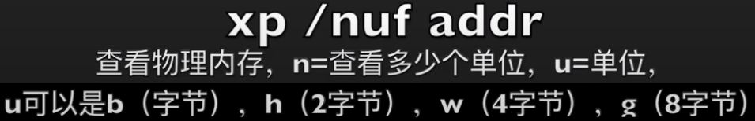
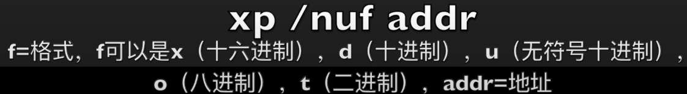

# 004 - Bochs

**macOS**

* `brew install bochs`

**Ubuntu**

* `apt-get install vagbios bochs bochs-x bximage`

**创建磁盘**

* 软盘: `bximage -mode=create -fd=1.44M -q a.img`
* 硬盘: `bximage -mode=create -hd=10M -q c.img`

## Debug

* `s`: 单步执行
* `b`: 断点
* `c`: 持续执行
* `r`: 显示通用寄存器的内容
* `sreg`: 显示段寄存器
* `creg`: 显示控制寄存器
* `q`: 退出
* `n`: 自动完成循环过程， 并在循环体外的下一条指令前停住 / rep、loop
* `u`: 反汇编，第一个参数是跟在 / 后面的数字，指定反汇编出多少条指令；第二个参数用于指定一个内存地址
* `info eflag`: 显示标志寄存器的状态, 标志名称是小写的，说明该标志位是 0; 否则改标志位的状态为 1
* `print-stack`: 查看栈

**Ref**

* 5.9.2 Bochs 下的程序调试入门 -  《x86汇编语言 - 从实模式到保护模式》
* 6.12 本章程序的调试 - 《x86汇编语言 - 从实模式到保护模式》
* 7.6.2 在调试过程中查看栈中内容 - 《x86汇编语言 - 从实模式到保护模式》
* 3.4 bochs 调试方法 - 《操作系统真象还原》
* [「Coding Master」第12话 如何正确的调试汇编程序](https://www.youtube.com/watch?v=EJgdGTAixVg&list=PLLBMaJy_MOpM2xUPbjSBSib7hUUaaEGa6&index=14)

## Ref

* [https://bochs.sourceforge.io/](https://bochs.sourceforge.io/)
* [http://nongnu.org/vgabios/](http://nongnu.org/vgabios/)
* [Bochs简易教程](http://www.edu2act.cn/article/bochsjian-yi-jiao-cheng/)

